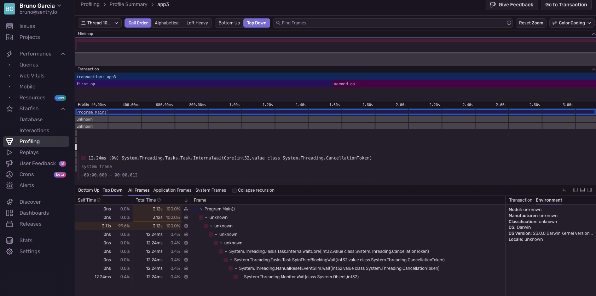

Adapted from the Sentry sample, 1 transaction with 2 spans each having a CPU intensive function call.

Symbols are uploaded:

```shell
  Determining projects to restore...
  All projects are up-to-date for restore.
  ConsoleApp -> /Users/bruno/temp/ConsoleApp/bin/Debug/net8.0/ConsoleApp.dll
  Preparing upload to Sentry for project 'ConsoleApp' (Debug/net8.0): collecting debug symbols and referenced source code from bin/Debug/net8.0/
  > Found 1 debug information file
  > Resolved source code for 1 debug information file
  > Prepared debug information files for upload
  > Uploaded 2 missing debug information files
  > File upload complete:
  
    UPLOADED 1c38aaad-27fd-4a39-9187-27634eea02a3-b6d4c756 (ConsoleApp.pdb;  debug companion)
    UPLOADED 1c38aaad-27fd-4a39-9187-27634eea02a3-b6d4c756 (ConsoleApp.pdb;  sources)
```
And the 2 functions show as `unknown` instead of `DoPrimeStuff` and `FindPrimeNumber`:

